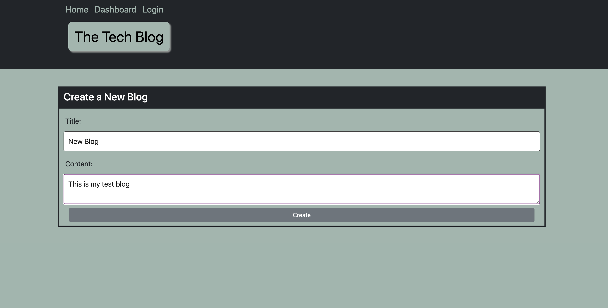
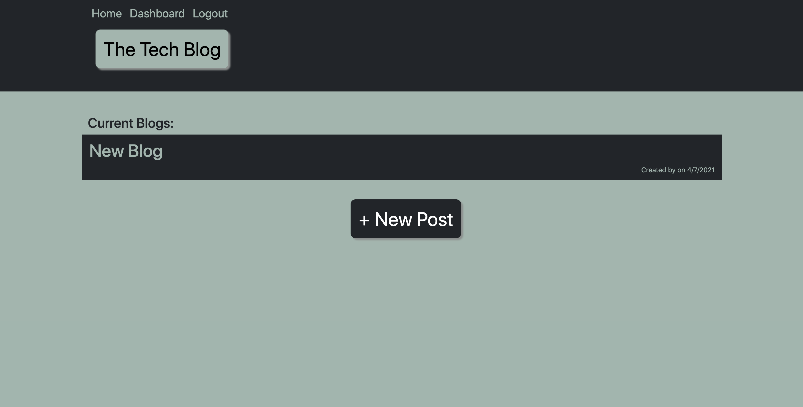
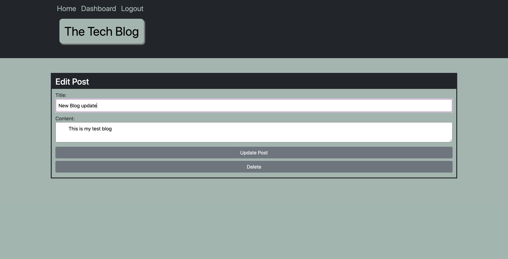

# The Tech Blog

## Table of Contents

* [Description](#description)
* [Installation](#installation)
* [Usage](#usage)
* [Contributing](#contributing)
* [Tests](#tests)
* [Questions](#questions)
* [License](#license)

## Description
A technology based blogging website that allows users to securely create, update, and delete their own blogs, as well as comment on another user's blog.

## Installation
run 'npm i' in the command line
## Usage
Once tables are built in MySQL, run 'npm run watch' in command line
### Screenshots

### Links
* [Github: Tech Blog](https://github.com/CFox2019/Tech-Blog)
* [Live Heroku link: The Tech Blog](https://the-tech-blog.herokuapp.com/)

## Contributing
If you'd like to contribute to this project, start by forking the repository to your personal GitHub account. From there, make your changes and then open a Pull Request in this repository against the branch in your fork.

## Tests
You can test by using Postman

## Questions
GitHub: [CFox2019](https://github.com/CFox2019)

Email me at [courtney.fox@me.com](courtney.fox@me.com) with additional questions.

## License
This project is covered under the MIT license.
