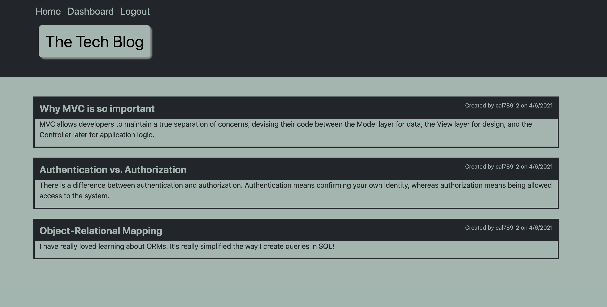
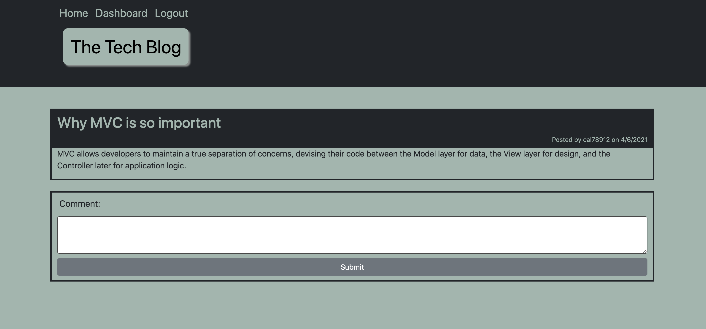
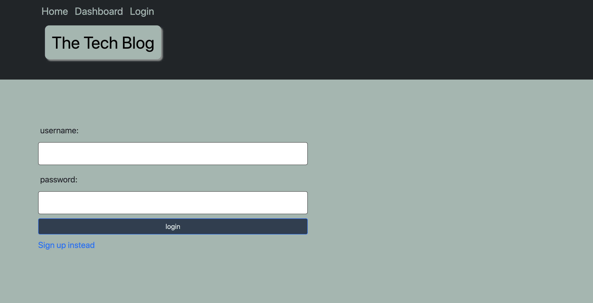
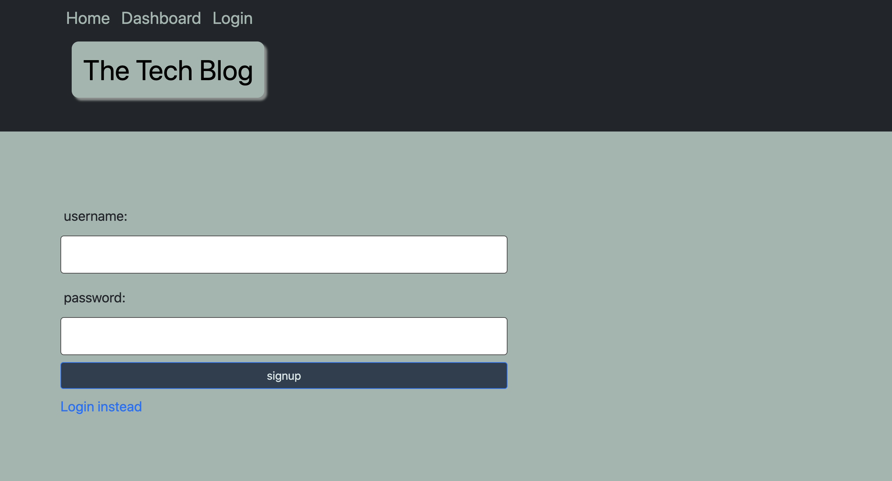

# Tech Blog

## Table of Contents

* [Description](#description)
* [Usage](#usage)
* [Contributing](#contributing)
* [Tests](#tests)
* [Questions](#questions)
* [License](#license)

## Description
A technology based blogging website that allows users to securely create, update, and delete their own blogs, as well as comment on another user's blog.
## Usage
Once you are on the Tech Blog website, you can view blogs, which are public. In order to get to your dashboard to create, update, or delete your own blogs, or to comment on another user's blog, you must login in, or signup if you haven't already. Once you are logged in, you may create a new post, update or delete any already created blogs. You may also click on anyones blog to comment on the selected blog.

### Screenshots

### Links
* [Github: Tech Blog](https://github.com/CFox2019/Tech-Blog)
* [Live Heroku link: The Tech Blog]()

## Contributing
If you'd like to contribute to this project, start by forking the repository to your personal GitHub account. From there, make your changes and then open a Pull Request in this repository against the branch in your fork.

## Tests
You can test by using Postman

## Questions
GitHub: [CFox2019](https://github.com/CFox2019)

Email me at [courtney.fox@me.com](courtney.fox@me.com) with additional questions.

## License
This project is covered under the MIT license.
